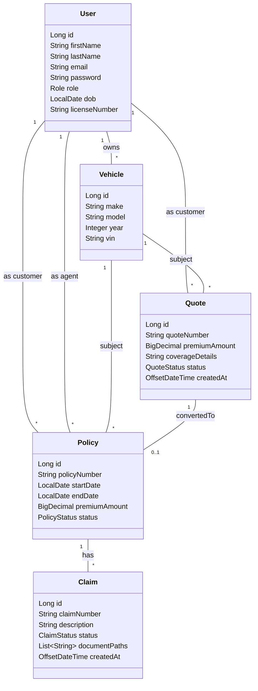
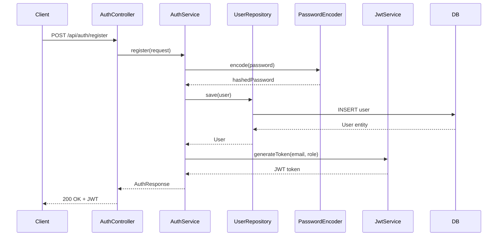
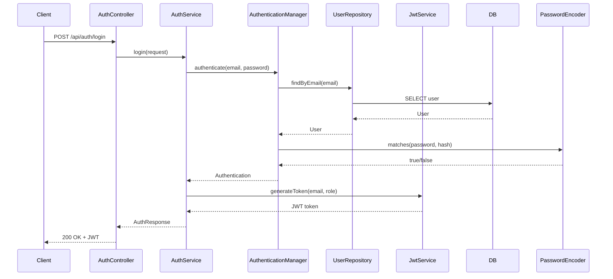
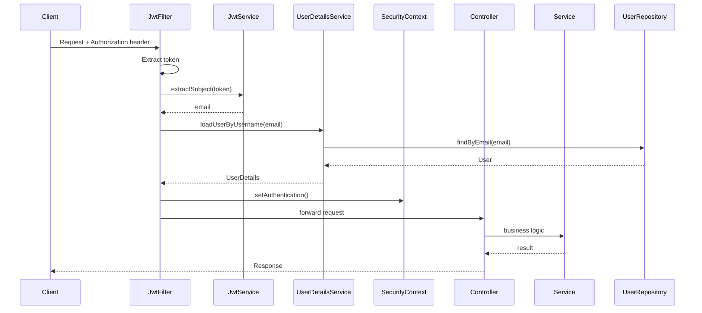

# Mercury PAS Backend - Complete Architecture Documentation

## Table of Contents
1. [Overview](#overview)
2. [Technology Stack](#technology-stack)
3. [Project Structure](#project-structure)
4. [Configuration](#configuration)
5. [Security Architecture](#security-architecture)
6. [Data Model](#data-model)
7. [API Endpoints](#api-endpoints)
8. [Service Layer](#service-layer)
9. [Business Logic](#business-logic)
10. [Exception Handling](#exception-handling)
11. [Database Design](#database-design)
12. [Authentication & Authorization Flow](#authentication--authorization-flow)
13. [Build & Deployment](#build--deployment)
14. [Testing](#testing)
15. [API Documentation](#api-documentation)

---

## Overview

Mercury Policy Administration System (PAS) is a comprehensive auto insurance management platform built with Spring Boot 3. The system provides a RESTful API for managing users, quotes, policies, and claims with role-based access control. The backend follows a layered architecture pattern with clear separation of concerns.

### Key Features
- **User Management**: Registration, authentication, profile management
- **Quote Management**: Automated quote generation with pricing rules
- **Policy Management**: Policy creation, updates, and lifecycle management
- **Claims Management**: Claim filing and document management
- **Role-Based Access Control**: ADMIN, AGENT, and CUSTOMER roles
- **JWT Authentication**: Stateless authentication using JSON Web Tokens
- **RESTful API**: Clean, DTO-based API design
- **OpenAPI Documentation**: Swagger UI integration

---

## Technology Stack

### Core Framework
- **Java 17**: Modern Java features and performance improvements
- **Spring Boot 3.3.5**: Enterprise-grade application framework
- **Spring Security**: Authentication and authorization
- **Spring Data JPA**: Database abstraction layer
- **Hibernate**: ORM framework

### Database
- **MySQL 8**: Relational database management system
- **JPA/Hibernate**: Object-relational mapping

### Security
- **JWT (JSON Web Tokens)**: Stateless authentication
- **BCrypt**: Password hashing algorithm
- **Spring Security OAuth2 Resource Server**: JWT validation

### Utilities
- **Lombok**: Reduces boilerplate code
- **ModelMapper**: Entity-to-DTO mapping
- **Jakarta Validation**: Input validation

### API Documentation
- **SpringDoc OpenAPI 2.8.13**: Swagger UI integration

### Testing
- **JUnit 5**: Unit testing framework
- **Mockito**: Mocking framework
- **Spring Boot Test**: Integration testing support

---

## Project Structure

```
src/main/java/com/mercury/pas/
├── config/                    # Application configuration
│   ├── DataInitializer.java   # Seed data for development
│   ├── ModelMapperConfig.java # DTO mapping configuration
│   ├── OpenApiConfig.java     # Swagger/OpenAPI configuration
│   └── SecurityConfig.java    # Spring Security configuration
│
├── controller/                # REST API controllers
│   ├── AuthController.java    # Authentication endpoints
│   ├── UserController.java   # User management endpoints
│   ├── QuoteController.java  # Quote management endpoints
│   ├── PolicyController.java # Policy management endpoints
│   └── ClaimController.java   # Claim management endpoints
│
├── exception/                 # Exception handling
│   ├── GlobalExceptionHandler.java # Global exception handler
│   └── NotFoundException.java     # Custom exception
│
├── model/
│   ├── dto/                   # Data Transfer Objects (DTOs)
│   │   ├── AuthDtos.java      # Authentication DTOs
│   │   ├── UserDtos.java      # User DTOs
│   │   ├── QuoteDtos.java     # Quote DTOs
│   │   ├── PolicyDtos.java    # Policy DTOs
│   │   └── ClaimDtos.java     # Claim DTOs
│   │
│   ├── entity/                # JPA entities (domain model)
│   │   ├── User.java          # User entity
│   │   ├── Vehicle.java       # Vehicle entity
│   │   ├── Quote.java         # Quote entity
│   │   ├── Policy.java        # Policy entity
│   │   └── Claim.java         # Claim entity
│   │
│   └── enums/                 # System enumerations
│       ├── Role.java          # User roles
│       ├── QuoteStatus.java   # Quote statuses
│       ├── PolicyStatus.java  # Policy statuses
│       └── ClaimStatus.java   # Claim statuses
│
├── repository/                # Spring Data JPA repositories
│   ├── UserRepository.java
│   ├── VehicleRepository.java
│   ├── QuoteRepository.java
│   ├── PolicyRepository.java
│   └── ClaimRepository.java
│
├── security/                  # Security components
│   ├── JwtService.java        # JWT token generation/parsing
│   ├── JwtAuthenticationFilter.java # JWT filter
│   └── CustomUserDetailsService.java # User details service
│
├── service/                   # Service interfaces
│   ├── AuthService.java
│   ├── UserService.java
│   ├── QuoteService.java
│   ├── PolicyService.java
│   └── ClaimService.java
│
└── service/impl/              # Service implementations
    ├── AuthServiceImpl.java
    ├── UserServiceImpl.java
    ├── QuoteServiceImpl.java
    ├── PolicyServiceImpl.java
    └── ClaimServiceImpl.java
```

---

## Configuration

### Application Properties (`application.yml`)

```yaml
spring:
  datasource:
    url: jdbc:mysql://localhost:3306/mercury_pas?createDatabaseIfNotExist=true&useSSL=false&allowPublicKeyRetrieval=true
    username: root
    password: root
    driver-class-name: com.mysql.cj.jdbc.Driver
  
  jpa:
    hibernate:
      ddl-auto: update  # Auto-create/update database schema
    properties:
      hibernate:
        format_sql: true
        dialect: org.hibernate.dialect.MySQL8Dialect
    open-in-view: false  # Best practice: disable OSIV
  
  jackson:
    serialization:
      write-dates-as-timestamps: false  # ISO-8601 date format

server:
  port: 8080

app:
  security:
    jwt:
      secret: "replace-with-a-secure-256-bit-secret-value"
      expiration-ms: 3600000  # 1 hour

logging:
  level:
    org.springframework.security: INFO
    org.hibernate.SQL: INFO
```

### Key Configuration Classes

#### 1. SecurityConfig
- **Purpose**: Configures Spring Security with JWT authentication
- **Key Features**:
  - Stateless session management
  - CSRF disabled (stateless API)
  - Public endpoints: `/api/auth/**`, Swagger endpoints
  - JWT filter integration
  - BCrypt password encoder
  - Method-level security enabled

#### 2. OpenApiConfig
- **Purpose**: Configures Swagger/OpenAPI documentation
- **Features**:
  - Bearer JWT security scheme
  - API metadata (title, description, version)
  - Accessible at `/swagger-ui.html`

#### 3. ModelMapperConfig
- **Purpose**: Configures ModelMapper bean for entity-to-DTO conversion
- **Usage**: Automatically maps entity fields to DTO fields

#### 4. DataInitializer
- **Purpose**: Seeds initial data on application startup
- **Default Users**:
  - `admin@mercury.com` / `Admin@123` (ADMIN)
  - `agent@mercury.com` / `Agent@123` (AGENT)
  - `customer@mercury.com` / `Customer@123` (CUSTOMER)

---

## Security Architecture

### Authentication Flow

1. **Registration/Login**: User provides credentials
2. **Password Verification**: BCrypt hash comparison
3. **JWT Generation**: Token created with user email and role
4. **Token Storage**: Client stores token (localStorage/cookie)
5. **Request Authentication**: Token sent in `Authorization: Bearer <token>` header
6. **Token Validation**: Filter validates token and sets authentication context

### JWT Token Structure

```json
{
  "sub": "user@example.com",
  "role": "CUSTOMER",
  "iat": 1234567890,
  "exp": 1234571490
}
```

### Security Components

#### JwtService
- **generateToken()**: Creates JWT with subject (email), claims (role), issued at, and expiration
- **extractSubject()**: Extracts email from token for authentication
- **Key Management**: Uses HMAC-SHA256 with secret key from configuration

#### JwtAuthenticationFilter
- **Purpose**: Intercepts all requests to validate JWT tokens
- **Flow**:
  1. Extracts token from `Authorization` header
  2. Validates token using JwtService
  3. Loads user details from database
  4. Sets authentication in SecurityContext
  5. Forwards request to controller

#### CustomUserDetailsService
- **Purpose**: Loads user details for Spring Security
- **Implementation**: Queries UserRepository by email and creates UserDetails with role authority

### Role-Based Access Control (RBAC)

#### ADMIN Role
- Full access to all endpoints
- User management: list all users, delete users
- Policy management: create, update, delete policies
- Claim document upload

#### AGENT Role
- Quote to policy conversion
- Policy creation and management
- View policies by agent
- Claim document upload
- Read access to quotes, policies, claims

#### CUSTOMER Role
- Self-registration and profile management
- Generate and view own quotes
- View own policies
- File claims on own policies
- Limited to own data

### Security Annotations

- `@PreAuthorize("hasRole('ADMIN')")`: Admin-only access
- `@PreAuthorize("hasAnyRole('AGENT','ADMIN')")`: Agent or Admin access
- No annotation: Authenticated users only

---

## Data Model

### Entity Relationships



### Entity Details

#### User Entity
- **Table**: `users`
- **Indexes**: `email` (unique)
- **Relationships**:
  - One-to-Many with Vehicle (owner)
  - One-to-Many with Quote (customer)
  - One-to-Many with Policy (customer or agent)
- **Fields**:
  - `id`: Primary key (auto-generated)
  - `email`: Unique identifier for authentication
  - `password`: BCrypt hashed
  - `role`: ADMIN, AGENT, or CUSTOMER

#### Vehicle Entity
- **Table**: `vehicles`
- **Indexes**: `vin` (unique)
- **Relationships**:
  - Many-to-One with User (owner)
  - One-to-Many with Quote
  - One-to-Many with Policy
- **Fields**:
  - `vin`: Vehicle Identification Number (unique)

#### Quote Entity
- **Table**: `quotes`
- **Indexes**: `quoteNumber` (unique)
- **Relationships**:
  - Many-to-One with Vehicle
  - Many-to-One with User (customer)
  - One-to-One with Policy (optional)
- **Fields**:
  - `quoteNumber`: Auto-generated format `MER-QUO-{UUID}`
  - `status`: GENERATED, SAVED, or CONVERTED

#### Policy Entity
- **Table**: `policies`
- **Indexes**: `policyNumber` (unique)
- **Relationships**:
  - One-to-One with Quote (source)
  - Many-to-One with Vehicle
  - Many-to-One with User (customer)
  - Many-to-One with User (agent)
  - One-to-Many with Claim
- **Fields**:
  - `policyNumber`: Auto-generated format `MER-POL-{timestamp}`
  - `status`: ACTIVE, EXPIRED, or CANCELLED

#### Claim Entity
- **Table**: `claims`
- **Indexes**: `claimNumber` (unique)
- **Relationships**:
  - Many-to-One with Policy
  - Many-to-One with User (customer)
- **Fields**:
  - `claimNumber`: Auto-generated format `MER-CLM-{UUID}`
  - `documentPaths`: Collection of document file paths
  - `status`: NEW, UNDER_REVIEW, APPROVED, or REJECTED

### Enumerations

#### Role
- `ADMIN`: System administrator
- `AGENT`: Insurance agent
- `CUSTOMER`: Policyholder

#### QuoteStatus
- `GENERATED`: Quote automatically generated
- `SAVED`: Quote manually saved
- `CONVERTED`: Quote converted to policy

#### PolicyStatus
- `ACTIVE`: Policy is active
- `EXPIRED`: Policy has expired
- `CANCELLED`: Policy cancelled

#### ClaimStatus
- `NEW`: Newly filed claim
- `UNDER_REVIEW`: Claim under review
- `APPROVED`: Claim approved
- `REJECTED`: Claim rejected

---

## API Endpoints

### Authentication Endpoints (`/api/auth`)

#### POST `/api/auth/register`
- **Description**: Register a new user
- **Access**: Public
- **Request Body**:
  ```json
  {
    "firstName": "John",
    "lastName": "Doe",
    "email": "john@example.com",
    "password": "password123",
    "role": "CUSTOMER",
    "dob": "1990-01-01",
    "licenseNumber": "DL123456"
  }
  ```
- **Response**: `AuthResponse` with JWT token

#### POST `/api/auth/login`
- **Description**: Authenticate user and receive JWT token
- **Access**: Public
- **Request Body**:
  ```json
  {
    "email": "john@example.com",
    "password": "password123"
  }
  ```
- **Response**: `AuthResponse` with JWT token

#### POST `/api/auth/reset-password`
- **Description**: Reset user password
- **Access**: Public
- **Request Body**:
  ```json
  {
    "email": "john@example.com",
    "newPassword": "newpassword123"
  }
  ```

### User Endpoints (`/api/users`)

#### GET `/api/users/me`
- **Description**: Get current authenticated user profile
- **Access**: Authenticated
- **Response**: `UserResponse`

#### PUT `/api/users/update-profile`
- **Description**: Update current user profile
- **Access**: Authenticated
- **Request Body**: `UpdateProfileRequest`

#### GET `/api/users/all`
- **Description**: Get all users
- **Access**: ADMIN only
- **Response**: List of `UserResponse`

#### DELETE `/api/users/{id}`
- **Description**: Delete user by ID
- **Access**: ADMIN only

### Quote Endpoints (`/api/quotes`)

#### POST `/api/quotes/generate`
- **Description**: Generate a new quote with automatic pricing
- **Access**: Authenticated
- **Request Body**:
  ```json
  {
    "customerId": 1,
    "make": "Toyota",
    "model": "Camry",
    "year": 2020,
    "vin": "1HGBH41JXMN109186",
    "driverAge": 30
  }
  ```
- **Response**: `QuoteResponse`

#### POST `/api/quotes/save`
- **Description**: Save a manually created quote
- **Access**: Authenticated
- **Request Body**: `SaveQuoteRequest`

#### GET `/api/quotes/{id}`
- **Description**: Get quote by ID
- **Access**: Authenticated
- **Response**: `QuoteResponse`

#### GET `/api/quotes/customer/{customerId}`
- **Description**: Get all quotes for a customer
- **Access**: Authenticated
- **Response**: List of `QuoteResponse`

#### POST `/api/quotes/convert-to-policy/{quoteId}?agentId={agentId}`
- **Description**: Convert a quote to a policy
- **Access**: AGENT or ADMIN
- **Response**: Policy ID

### Policy Endpoints (`/api/policies`)

#### POST `/api/policies/create`
- **Description**: Create a new policy from a quote
- **Access**: AGENT or ADMIN
- **Request Body**:
  ```json
  {
    "quoteId": 1,
    "agentId": 2,
    "startDate": "2024-01-01",
    "endDate": "2025-01-01"
  }
  ```
- **Response**: `PolicyResponse`

#### GET `/api/policies/{id}`
- **Description**: Get policy by ID
- **Access**: Authenticated
- **Response**: `PolicyResponse`

#### GET `/api/policies/customer/{customerId}`
- **Description**: Get all policies for a customer
- **Access**: Authenticated
- **Response**: List of `PolicyResponse`

#### GET `/api/policies/agent/{agentId}`
- **Description**: Get all policies for an agent
- **Access**: AGENT or ADMIN
- **Response**: List of `PolicyResponse`

#### PUT `/api/policies/{id}`
- **Description**: Update policy details
- **Access**: AGENT or ADMIN
- **Request Body**: `CreatePolicyRequest`

#### DELETE `/api/policies/{id}`
- **Description**: Delete a policy
- **Access**: AGENT or ADMIN

### Claim Endpoints (`/api/claims`)

#### POST `/api/claims/file`
- **Description**: File a new claim
- **Access**: Authenticated
- **Request Body**:
  ```json
  {
    "policyId": 1,
    "customerId": 1,
    "description": "Accident on highway"
  }
  ```
- **Response**: `ClaimResponse`

#### GET `/api/claims/{id}`
- **Description**: Get claim by ID
- **Access**: Authenticated
- **Response**: `ClaimResponse`

#### GET `/api/claims/policy/{policyId}`
- **Description**: Get all claims for a policy
- **Access**: Authenticated
- **Response**: List of `ClaimResponse`

#### POST `/api/claims/upload-document/{claimId}`
- **Description**: Upload document path for a claim
- **Access**: AGENT or ADMIN
- **Request Body**:
  ```json
  {
    "path": "/documents/claim-123-accident-report.pdf"
  }
  ```
- **Response**: `ClaimResponse`

---

## Service Layer

### Service Architecture

All services follow the same pattern:
1. **Interface**: Defines service contract
2. **Implementation**: Contains business logic
3. **Transaction Management**: `@Transactional` for data consistency
4. **DTO Mapping**: Converts entities to DTOs using ModelMapper

### AuthService

#### Methods
- `register(RegisterRequest)`: Creates new user, hashes password, generates JWT
- `login(LoginRequest)`: Authenticates user, generates JWT
- `resetPassword(ResetPasswordRequest)`: Updates user password
- `me()`: Returns current authenticated user

#### Implementation Details
- Uses `AuthenticationManager` for login authentication
- BCrypt password encoding
- JWT token generation with role claim
- Email normalization (lowercase)

### UserService

#### Methods
- `getCurrentUser()`: Retrieves authenticated user from SecurityContext
- `updateProfile(UpdateProfileRequest)`: Updates user profile fields
- `getAll()`: Lists all users (admin only)
- `deleteById(Long)`: Deletes user by ID

#### Implementation Details
- Extracts email from SecurityContext for current user operations
- Email normalization on update

### QuoteService

#### Methods
- `generate(GenerateQuoteRequest)`: Generates quote with automatic pricing
- `save(SaveQuoteRequest)`: Saves manually created quote
- `getById(Long)`: Retrieves quote by ID
- `getByCustomer(Long)`: Lists quotes for customer
- `convertToPolicy(Long, Long)`: Converts quote to policy

#### Implementation Details
- **Pricing Algorithm**:
  - Base premium: $3,000
  - +20% if driver age < 25
  - +15% if vehicle age > 10 years
- Auto-creates vehicle if VIN not found
- Generates unique quote numbers: `MER-QUO-{UUID}`
- Updates quote status to CONVERTED when converted to policy

### PolicyService

#### Methods
- `create(CreatePolicyRequest)`: Creates policy from quote
- `getById(Long)`: Retrieves policy by ID
- `getByCustomer(Long)`: Lists policies for customer
- `getByAgent(Long)`: Lists policies for agent
- `update(Long, CreatePolicyRequest)`: Updates policy dates
- `delete(Long)`: Deletes policy

#### Implementation Details
- Links policy to quote, vehicle, customer, and agent
- Generates unique policy numbers: `MER-POL-{timestamp}`
- Default status: ACTIVE
- Default duration: 1 year from start date

### ClaimService

#### Methods
- `fileClaim(FileClaimRequest)`: Creates new claim
- `getById(Long)`: Retrieves claim by ID
- `getByPolicy(Long)`: Lists claims for policy
- `uploadDocument(Long, UploadDocumentRequest)`: Adds document path to claim

#### Implementation Details
- Generates unique claim numbers: `MER-CLM-{UUID}`
- Default status: NEW
- Document paths stored as collection in separate table
- Validates policy and customer existence

---

## Business Logic

### Quote Generation Pricing Rules

```java
private BigDecimal calculatePremium(int driverAge, int vehicleYear) {
    BigDecimal base = BigDecimal.valueOf(3000);
    BigDecimal premium = base;
    
    // Young driver surcharge
    if (driverAge < 25) {
        premium = premium.add(base.multiply(BigDecimal.valueOf(0.20)));
    }
    
    // Old vehicle surcharge
    int currentYear = Year.now().getValue();
    if (currentYear - vehicleYear > 10) {
        premium = premium.add(base.multiply(BigDecimal.valueOf(0.15)));
    }
    
    return premium;
}
```

### Quote to Policy Conversion

1. Validates quote and agent existence
2. Creates policy with:
   - Unique policy number
   - Links to quote, vehicle, customer, agent
   - Start and end dates
   - Premium from quote
   - Status: ACTIVE
3. Updates quote status to CONVERTED

### Vehicle Management

- Vehicles are auto-created during quote generation if VIN not found
- VIN is unique identifier
- Vehicles are linked to customers

### Claim Lifecycle

1. **NEW**: Claim filed by customer
2. **UNDER_REVIEW**: Agent/Admin reviews claim
3. **APPROVED**: Claim approved for payment
4. **REJECTED**: Claim denied

### Document Management

- Document paths stored as strings in `claim_documents` table
- Multiple documents per claim supported
- File storage not implemented (paths only)

---

## Exception Handling

### GlobalExceptionHandler

Centralized exception handling using `@RestControllerAdvice`:

#### NotFoundException
- **HTTP Status**: 404 Not Found
- **Response**:
  ```json
  {
    "timestamp": "2024-01-01T12:00:00Z",
    "status": 404,
    "message": "Resource not found"
  }
  ```

#### MethodArgumentNotValidException
- **HTTP Status**: 400 Bad Request
- **Response**:
  ```json
  {
    "timestamp": "2024-01-01T12:00:00Z",
    "status": 400,
    "errors": {
      "email": "must be a valid email",
      "password": "size must be at least 6"
    }
  }
  ```

#### Generic Exception
- **HTTP Status**: 500 Internal Server Error
- **Response**: Error message

### Custom Exceptions

#### NotFoundException
- Used when entity not found in database
- Thrown by services when `Optional.empty()` is encountered

---

## Database Design

### Schema Generation

- **Strategy**: `ddl-auto: update`
- Hibernate automatically creates/updates schema on startup
- Indexes defined in entity annotations

### Indexes

- `users.email`: Unique index for fast lookups
- `quotes.quoteNumber`: Unique index
- `policies.policyNumber`: Unique index
- `claims.claimNumber`: Unique index
- `vehicles.vin`: Unique index

### Relationships

- **Lazy Loading**: All relationships use `FetchType.LAZY` for performance
- **Cascade**: No cascade operations (explicit saves required)
- **Join Columns**: Foreign keys named `{entity}_id`

### Data Types

- **IDs**: `BIGINT` (Long)
- **Decimals**: `DECIMAL(12,2)` for monetary values
- **Strings**: `VARCHAR(255)` default, `TEXT` for large content
- **Dates**: `DATE` for LocalDate, `DATETIME` for OffsetDateTime
- **Enums**: `VARCHAR` stored as string values

---

## Authentication & Authorization Flow

### Registration Flow



### Login Flow



### Request Authentication Flow



---

## Build & Deployment

### Prerequisites

- **JDK 17**: Java Development Kit
- **Maven 3.6+**: Build tool
- **MySQL 8**: Database server
- **IDE**: IntelliJ IDEA, Eclipse, or VS Code

### Build Steps

1. **Configure Database**:
   - Update `application.yml` with database credentials
   - Ensure MySQL is running
   - Database will be auto-created if not exists

2. **Configure JWT Secret**:
   - Update `app.security.jwt.secret` in `application.yml`
   - Use a secure 256-bit secret (Base64 encoded)

3. **Build Project**:
   ```bash
   mvn clean package
   ```

4. **Run Application**:
   ```bash
   mvn spring-boot:run
   ```
   Or:
   ```bash
   java -jar target/mercury-pas-0.0.1-SNAPSHOT.jar
   ```

5. **Verify**:
   - Application starts on `http://localhost:8080`
   - Swagger UI: `http://localhost:8080/swagger-ui.html`
   - Default users created automatically

### Production Considerations

- **JWT Secret**: Use environment variable or secret management
- **Database**: Use connection pooling, read replicas
- **Logging**: Configure log levels and appenders
- **Monitoring**: Add health checks, metrics
- **Security**: Enable HTTPS, rate limiting
- **CORS**: Configure for frontend domain

---

## Testing

### Test Structure

```
src/test/java/com/mercury/pas/
├── controller/
│   ├── QuoteControllerTest.java
│   └── UserControllerTest.java
└── service/
    ├── AuthServiceTest.java
    ├── ClaimServiceTest.java
    ├── PolicyServiceTest.java
    └── QuoteServiceTest.java
```

### Running Tests

```bash
mvn test
```

### Test Coverage

- **Unit Tests**: Service layer with mocked repositories
- **Integration Tests**: Controller layer with MockMvc
- **Test Data**: In-memory database or mocks

### Example Test Structure

```java
@ExtendWith(MockitoExtension.class)
class QuoteServiceTest {
    @Mock
    private QuoteRepository quoteRepository;
    
    @InjectMocks
    private QuoteServiceImpl quoteService;
    
    @Test
    void testGenerateQuote() {
        // Test implementation
    }
}
```

---

## API Documentation

### Swagger UI

- **URL**: `http://localhost:8080/swagger-ui.html`
- **OpenAPI JSON**: `http://localhost:8080/v3/api-docs`

### Features

- Interactive API documentation
- Try-it-out functionality
- JWT authentication support
- Request/response schemas
- Error responses documented

### Using Swagger

1. Open Swagger UI in browser
2. Click "Authorize" button
3. Enter JWT token (from login)
4. Explore endpoints
5. Test API calls directly

### Postman Collection

A complete Postman collection is available at:
- `docs/Mercury_PAS.postman_collection.json`
- `docs/Mercury_PAS.postman_environment.json`

**Import Instructions**:
1. Open Postman
2. Click Import
3. Select collection and environment files
4. Use Login request to get JWT token
5. Token auto-saved to environment variable

---

## Additional Notes

### DTO Pattern

- **Purpose**: Prevent entity exposure, control API contract
- **Mapping**: ModelMapper automatically maps entities to DTOs
- **Validation**: Jakarta Validation annotations on DTOs
- **Records**: Java records used for immutable DTOs

### Transaction Management

- All service methods are `@Transactional`
- Automatic rollback on exceptions
- Read-only transactions for queries (optimization possible)

### Performance Considerations

- **Lazy Loading**: Reduces unnecessary database queries
- **Indexes**: Fast lookups on frequently queried fields
- **Connection Pooling**: Spring Boot default HikariCP
- **Query Optimization**: Use `@Query` for complex queries

### Future Enhancements

- Refresh tokens for long-lived sessions
- Token blacklist for logout
- File storage service (S3/Azure) for claim documents
- Policy endorsements and midterm changes
- Payment integration
- Email notifications
- Audit logging
- Rate limiting
- Caching layer (Redis)
- Multi-tenancy support

---

## Summary

The Mercury PAS backend is a well-architected Spring Boot application following industry best practices:

- **Layered Architecture**: Clear separation of concerns
- **Security**: JWT-based stateless authentication with RBAC
- **Data Integrity**: Transaction management and validation
- **API Design**: RESTful, DTO-based, well-documented
- **Maintainability**: Clean code, proper abstractions
- **Extensibility**: Easy to add new features and modules

The system provides a solid foundation for an auto insurance policy administration system with room for growth and enhancement.
